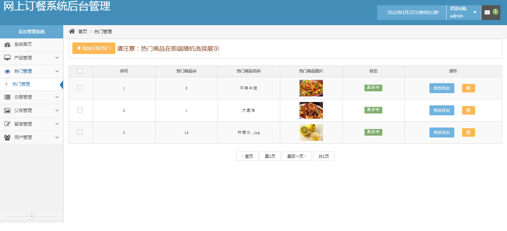
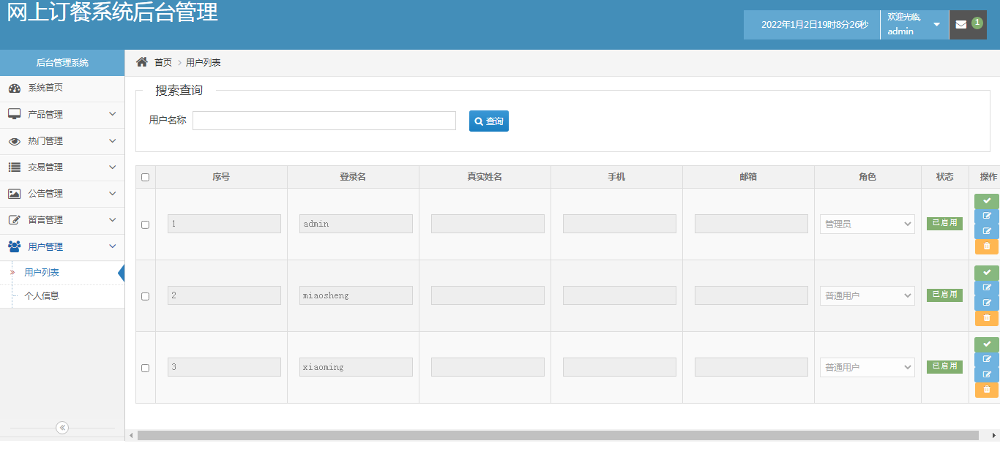
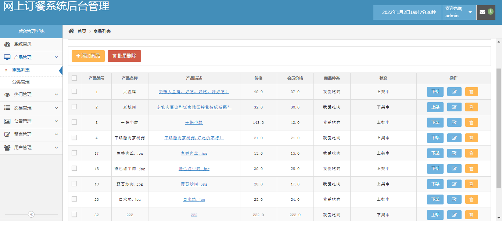
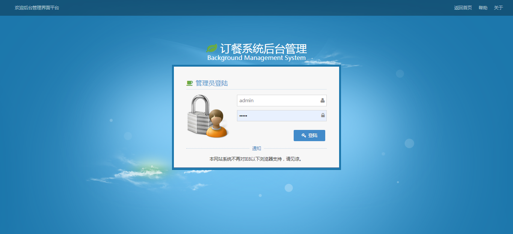
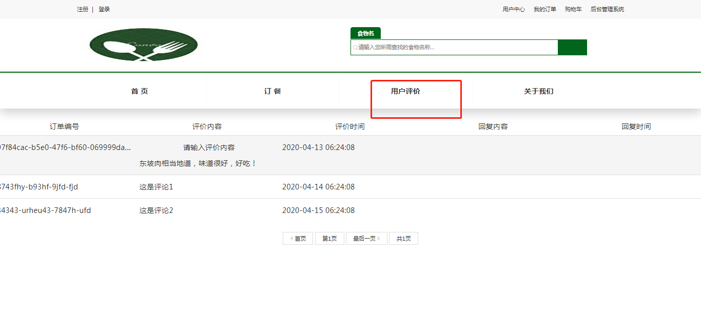
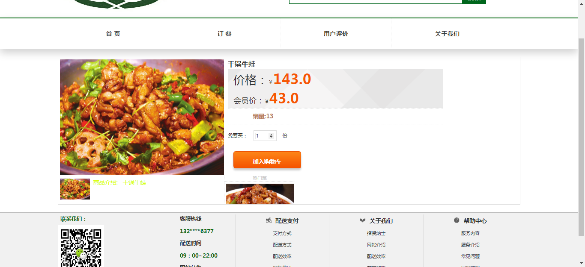
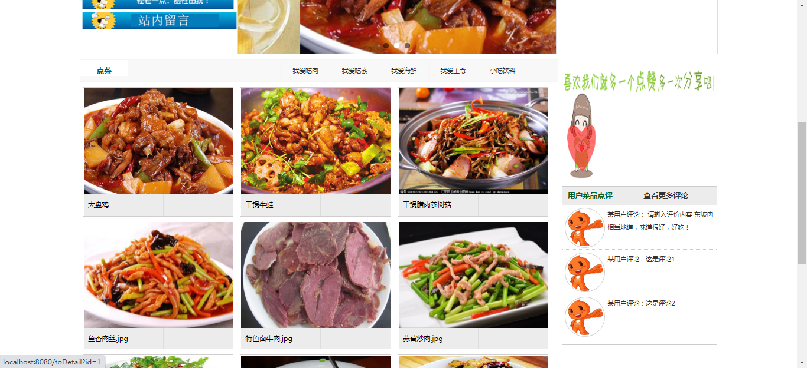
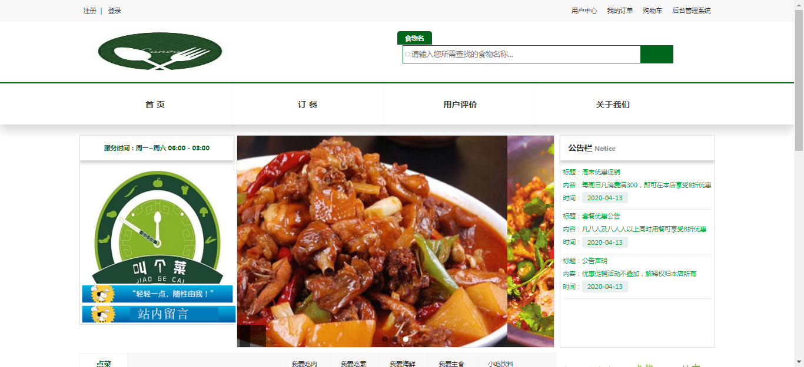
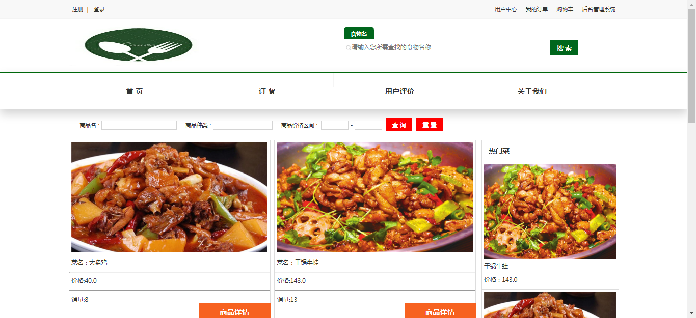

# 基于springboot的点餐系统

#### 介绍
基于springboot的点餐系统，前端采用html+bootstrap，主要分两端Web端与管理后端，代码规范整洁，技术选型也非常经典，合适初学java编程者学习以及计算机专业学生。

#### 软件架构
前端：html | jquery | bootstrap  
后端：spring | springmvc | mybatis  
环境：jdk1.8 | maven | mysql | tomcat      

#### 功能介绍

##### 【项目简述】

该项目是一款点餐系统，分为前端和后端两部分，前端负责菜品点餐，后端负责菜品管理和人员管理等运维工作。  

前端包含模块有：首页、订餐模块、购物车模块、订单模块、用户评价模块、关于我们等模块。  

后端包含模块有：系统首页、产品管理、热门管理、交易管理、公告管理、留言管理、用户管理等二级菜单，
二级菜单下面还有很多三级菜单，功能非常丰富。  

##### 【功能详述】 

- 热门管理

    

- 用户列表

    

- 商品列表

    

- 系统登陆

    

- 用户评价

    

- 商品详情

    

- 商品列表

    

- 商场首页

    

- 商城首页

    

#### 使用说明
1. 创建数据库，执行数据库脚本  
2. 修改jdbc数据库连接参数  
3. 下载安装maven依赖jar  
4. 启动SpringBoot启动类  

#### 后端管理

请求地址： http://localhost:8080/

用户名：admin

密码：123456   